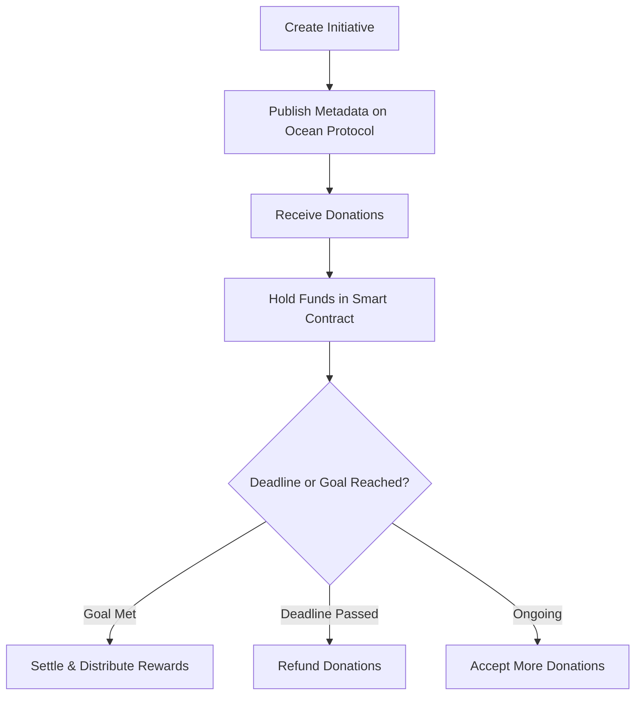

# Pay It Forward (PIF) 🌱

**ETHCluj Hackathon 2025**  
Empowering local communities, schools, and NGOs through transparent blockchain-based fundraising.

---

## 🧠 Project Summary

**Pay It Forward (PIF)** is a decentralized donation platform that allows parents, communities, and donors to fund school and local initiatives using crypto-backed smart contracts. 

Donors receive PIF tokens as a reward and can always trust that funds will be used transparently, via smart contracts.

> “A teacher launches a project to fund 10 new desks for a rural school. Donations flow in via a RON-pegged stablecoin, and each supporter receives PIF tokens as thanks. If the goal isn’t reached in 3 months, everyone gets their money back.”

---

## 💡 Key Features
- 🏗️ **Simple Architecture**
  Focused on ease of use and initiative creation.

- ⏳ **Time & Amount-Limited Initiatives**
  Projects have specific deadlines (max 3 months) and target amounts.

- 💸 **Automatic Refund Mechanism**
  If the goal isn’t met, smart contracts refund all donors without needing any manual action.

- 🪙 **Reward Token: PIF**  
  Every donor earns PIF tokens as recognition for their contribution.
  
- 🔒 **Transparent Smart Contract Logic**  
  All donations are locked in smart contracts until conditions are met (funded or expired).

- 🌊 **Ocean Protocol Integration**  
  Donation metadata is published as decentralized data assets for transparency and public access.

---

## 🔗 Architecture Overview

Each **Project** (school, NGO, etc.) can host multiple **Initiatives**.  

Each initiative includes:
- Goal amount in RON (via stable token)
- Deadline (max 3 months)
- Real-world purpose (e.g., buying 10 school benches)



All logic is handled on-chain through smart contracts written in Solidity using Hardhat.

> *(Planned IPFS support to attach image + description metadata to each initiative)*

---

## 🌊 Data Transparency with Ocean Protocol

To enhance trust, all initiative and donation metadata is published as **data NFTs** on Ocean Protocol.

- 🧾 Each initiative’s metadata is stored immutably (goal, deadline, description)
- 🌍 Donors can view real-time funding data via Ocean’s decentralized marketplace
- 🔐 Future expansion may use **Compute-to-Data** for insights while protecting donor privacy

This creates:
- A transparent, decentralized public record
- Verifiable donation history
- Potential for third-party analysis, funding metrics, and DAO integrations

---

## ⚙️ Tech Stack

- **Smart Contracts**: Solidity + Hardhat
- **Frontend**: [Coming Soon]
- **Tokens**:
  - `PIF`: ERC20 Reward Token
  - `RONToken`: Stablecoin-pegged donation token
- **Data Layer**: Ocean Protocol (data NFTs + metadata publishing)
  
---

## 🔐 Security Considerations

- ✅ All funds are time-locked until either:
  - Target is reached → allows payout
  - Deadline passes without funding → enables refund

- 🚫 No owner withdrawal privileges unless project conditions are fully met  
- ⚠️ Additional validation to prevent early rugpulls (donation lock-in period)

---

## 📽️ Pitch Deck

### 🇬🇧 English  
Check out our project pitch deck here:  
👉 [Pay It Forward – ETHCluj Pitch Deck](https://www.canva.com/design/DAGuupentiY/XolSy_w54JiZujdMBzzNcw/edit)

### 🇷🇴 Romanian  
> *Versiunea în limba română a pitch deck-ului va fi disponibilă în curând.*

---
## 📽️ Product Demo

Coming soon!

A short walkthrough of the donation flow, initiative creation, and reward system. 

📺 **[Placeholder:YouTube link]**

---

## 🚀 Roadmap

- [x] Smart contract: initiative creation, donation, refund, reward
- [ ] Integrate **Ocean Protocol** to publish donation/project metadata as decentralized data assets
- [ ] Finalize frontend integration  
- [ ] Record & embed product demo  
- [ ] Add initiative metadata to IPFS  
- [ ] Add community voting / upvote system  
- [ ] Add donor reputation scoring (future)  
- [ ] Launch a **Rewards Shop** where PIF tokens can be exchanged for:
  - Merch products  
  - Partner offers  
  - IRL benefits
     
---

## 👥 Team

We’re a team of builders passionate about Web3, transparency, and community-first fundraising.

- **David Nagy-Elek** — Smart Contracts & Protocol Integration  
- **Marian Stana** — Blockchain Enthusiast & Digital Marketing

> We're hacking this together at **ETHCluj 2025**, and open to collaborators or feedback — reach out!

---

## 🛠️ Developer Onboarding

### Requirements

- Node.js ≥ 18.x
- Hardhat ≥ 2.22
- Foundry (optional)
- Git & npm

### Getting Started

```bash
git clone https://github.com/ttc915/Pay-It-Forward.git
cd pay-it-forward
npm install
npx hardhat compile
```
